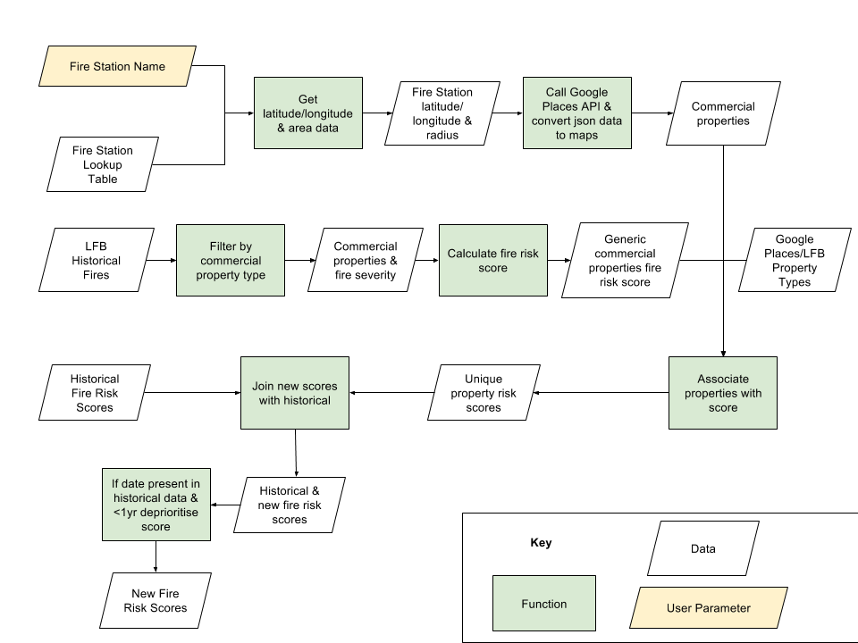

# Introduction to witan.gwyn

## Model outline

`witan.gwyn` aims to produce fire risk assessment scores as laid out on this flowchart:

The model expects *five inputs*: four datasets and a parameter. And it returns *one output*: a dataset.

**Note**: The last step that uses the historical fire risk scores to update the newly produced risk scores is not currently implemented and the model outputs the new risk scores.

## Input datasets

* The [`Fire station lookup table`](../data/fire_station_data.csv) contains geo data on the London Fire Brigade (LFB) fire stations.

* The [`LFB historical fires`](../data/lfb_historical_fire_non_residential.csv) dataset contains historical data from the LFB on fire incidents that happened on non-residential properties of different types.

* The [`Google Places / LFB property types`](../data/lfb_to_google.csv) lookup table matches non-residential property types from Google Places API with non-residential property types from the `LFB historical fires` dataset.

* The [`Historical fire risk scores`](../data/template-historical-fire-risk-scores.csv) is currently a placeholder for a file that will be provided by the user with properties previous fire risk assessment scores (generated by running this model) and properties lastest physical assessment by the LFB.

## Input parameter

This is the name of a fire station around which you want to produce fire risk assessment scores for non-residential properties.

The list of fire stations for which we have information in our current dataset can be find [here](../data/fire_station_data.csv).

## Output

The result is a dataset with a risk score attached to each property returned from Google API call around a particular fire station (provided as a parameter).

The lower the score, the lower the risk.

## Model steps

1. In the first branch of the flowchart above, a list of non-residential properties is generated from the result of calling the Google Places API using the coordinates and radius for a fire station specified as a parameter.

2. In parallel the list of LFB historical fires in non-residential properties is used to generate generic fire risk assessment scores. Those scores take into account the number of fires that happened at properties of a particular type and how many pumps were used to put out the fire.

3. The ouput of the two previous steps are then combined to associate each property from the list of non-residential properties (generated in `1.`) with a risk score (using the generic scores calculated for each property type in `2.`).
**Note**: This step relies on matching property types between the result of step `1.` and `2.`. For that reason we need the `Google Places / LFB property types` lookup table and we calculate an average if a property has several types associated to it.

4. This last step will be implemented once the model has already been run.
The information from the `Historical fire risk scores` will help update the fire risk assessment scores by lowering the score if a property has recently undergone a physical inspection from the LFB.
